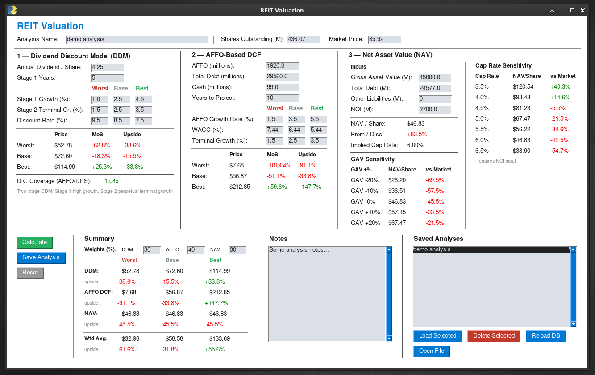

# REIT Valuation Tool


A Python desktop application for multi-model REIT valuation, combining three methodologies simultaneously with scenario analysis, sensitivity tables, and a local file-based database.

---

## Overview

The tool was built to support structured investment analysis of Real Estate Investment Trusts. It runs three independent valuation models side by side — DDM, AFFO DCF, and NAV — and produces a weighted cross-model summary that can be adjusted based on the REIT type. All analyses are saved as individual JSON files in a local `reit_db/` directory.

---
## Models

### 1. Two-Stage Dividend Discount Model (DDM)
- Stage 1: user-defined high-growth period (default 5 years)
- Stage 2: perpetual terminal growth rate
- Three scenarios: Worst / Base / Best
- Displays dividend coverage ratio (AFFO per share / DPS)

### 2. AFFO-Based DCF
- Discounted cash flow using Adjusted Funds from Operations
- Accounts for debt and cash in the equity bridge
- 10-year projection horizon (configurable)
- Three scenarios with independent WACC and terminal growth assumptions

### 3. Net Asset Value (NAV)
- NAV per share from Gross Asset Value, debt, and other liabilities
- Implied cap rate display (requires NOI input)
- **GAV sensitivity table**: NAV at ±10%, ±20% GAV
- **Cap rate sensitivity table**: NAV at cap rates from 3.5% to 6.5%
- Premium / discount to market price

---

## Weighting Guide

| REIT Type | Recommended Weighting |
|---|---|
| Property-heavy (core, net lease) | NAV 50–60%, AFFO DCF 30%, DDM 10–20% |
| Dividend-focused (mREITs, high-yield) | DDM 40–50%, AFFO DCF 30%, NAV 20–30% |
| Balanced (residential, diversified) | Equal weights (33/34/33) |

NAV should carry more weight when the portfolio consists of readily appraised assets (apartments, industrial, retail) and when the REIT is in an operational transition where current cash flows understate intrinsic value. DDM deserves more weight when dividend sustainability and growth are the primary investment thesis.

---

## Requirements
```
Python 3.9+
FreeSimpleGUI
```
---

## Database

**Local JSON database** — each analysis is saved as an individual `.json` file in `reit_db/`; analyses can be saved, loaded, deleted, and opened in the system editor from the GUI

**Database fields:**
| Field | Description |
|---|---|
| `analysis_name` | User-defined label |
| `shares` | Shares / units outstanding (millions) |
| `market_price` | Current market price |
| `dps` | Annual dividend per share |
| `ddm_stage1_years` | DDM Stage 1 projection years |
| `ddm_[worst/base/best]_growth` | Stage 1 growth rate per scenario |
| `ddm_[worst/base/best]_terminal` | Stage 2 terminal growth rate per scenario |
| `ddm_[worst/base/best]_rate` | Discount rate per scenario |
| `affo` | AFFO (millions, TTM) |
| `affo_debt` | Total debt (millions) |
| `affo_cash` | Cash & equivalents (millions) |
| `affo_years` | DCF projection years |
| `affo_[worst/base/best]_growth` | AFFO growth rate per scenario |
| `affo_[worst/base/best]_wacc` | WACC per scenario |
| `affo_[worst/base/best]_terminal` | Terminal growth rate per scenario |
| `gav` | Gross Asset Value (millions) |
| `nav_debt` | Total debt for NAV (millions) |
| `nav_other` | Other liabilities (millions) |
| `noi` | Net Operating Income (millions) |
| `w_ddm` / `w_affo` / `w_nav` | Model weights (%) |
| `notes` | Free-text notes |
| `analysis_date` | Auto-recorded date of save (YYYY-MM-DD) |

---


## Notes

- The AFFO DCF can return negative equity values for highly leveraged REITs with low near-term AFFO — this is mathematically correct and represents the model's assessment that equity has no residual value at the given WACC. It is not a bug.
- Margin of Safety (MoS) displays `—` when intrinsic price is negative or zero.
- Cap rate sensitivity requires the NOI field to be populated.
- Weights do not need to sum to 100 — the weighted average normalises automatically.
- In DDM, to run a single-stage model set Stage 1 Growth = Stage 2 Terminal Growth for whichever scenario you want to treat as single-stage. (You can mix: e.g., use two-stage for best case and single-stage logic for worst case within the same calculation.)
---

## License

MIT - do whatever you like.
